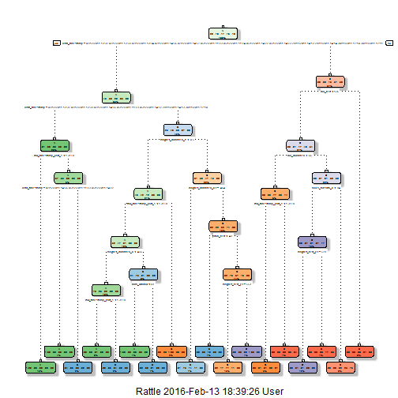

##Inroduction

Using devices such as Jawbone Up, Nike FuelBand, and Fitbit it is now possible to collect a large amount of data about personal activity relatively inexpensively. These type of devices are part of the quantified self movement - a group of enthusiasts who take measurements about themselves regularly to improve their health, to find patterns in their behavior, or because they are tech geeks. One thing that people regularly do is quantify how much of a particular activity they do, but they rarely quantify how well they do it. The goal of this project will be to use data from accelerometers on the belt, forearm, arm, and dumbell of 6 participants. They were asked to perform barbell lifts correctly and incorrectly in 5 different ways. More information is available from the website here: http://groupware.les.inf.puc-rio.br/har (see the section on the Weight Lifting Exercise Dataset).

##Data Source

The training data for this project are available here:
https://d396qusza40orc.cloudfront.net/predmachlearn/pml-training.csv

The test data are available here:
https://d396qusza40orc.cloudfront.net/predmachlearn/pml-testing.csv

##Expected Result Submited

1. The goal of this project is to predict the manner in which they did the exercise. This is the "classe" variable in the training set. The other variables may use to predict with.The report created should describe the folowing:

    1.1 how you built your model                                                                                      
    1.2 how you used cross validation                                                                                
    1.3 what you think the expected out of sample error is                                                           
    1.4 why you made the choices you did
 
2. Required to use the selected prediction model to predict 20 different test cases.
3. Submission required consist of a link to a Github repo with R markdown and compiled HTML file describing the data     analysis. The text of the writeup to < 2000 words and the number of figures to be less than 5.
4. Apply machine learning algorithm to the 20 test cases available in the test data above.

##Reproduceablity Set of Packeges

The following Libraries were used and should be installed for this project.


```r
library(caret)
library(rpart)
library(rpart.plot)
library(RColorBrewer)
library(rattle)
library(randomForest)
library(e1071)
```

Finally, load the same seed with the following line of code:


```r
set.seed(12345)
```

##Load the Data

First load the data to memory solely


```r
trainingData<-read.csv("pml-training.csv")
testingData<-read.csv("pml-testing.csv")
```

##Devided Training Dataset Into Two

Devided traning dataset into two, 60% for 
Partioning Training data set into two data sets, 60% for Training, 40% for Testing:

```r
startTrain <- createDataPartition(y=trainingData$classe, p=0.6, list=FALSE)
Training <- trainingData[startTrain, ] 
Testing <- trainingData[-startTrain, ]
dim(Training)
```

```
## [1] 11776   160
```

```r
dim(Testing)
```

```
## [1] 7846  160
```

##Cleaning the Data

The following transformations were used to clean the data:                                                            
1st Cleaning: Clean NearZeroVariance (NZV) Variables and run this code to view possible NZV Variables:


```r
DataNZV <- nearZeroVar(Training, saveMetrics=TRUE)
```

Run this code to create another subset without NZV variables:


```r
NZVvars <- names(Training) %in% c("new_window", "kurtosis_roll_belt", "kurtosis_picth_belt",
"kurtosis_yaw_belt", "skewness_roll_belt", "skewness_roll_belt.1", "skewness_yaw_belt",
"max_yaw_belt", "min_yaw_belt", "amplitude_yaw_belt", "avg_roll_arm", "stddev_roll_arm",
"var_roll_arm", "avg_pitch_arm", "stddev_pitch_arm", "var_pitch_arm", "avg_yaw_arm",
"stddev_yaw_arm", "var_yaw_arm", "kurtosis_roll_arm", "kurtosis_picth_arm",
"kurtosis_yaw_arm", "skewness_roll_arm", "skewness_pitch_arm", "skewness_yaw_arm",
"max_roll_arm", "min_roll_arm", "min_pitch_arm", "amplitude_roll_arm", "amplitude_pitch_arm",
"kurtosis_roll_dumbbell", "kurtosis_picth_dumbbell", "kurtosis_yaw_dumbbell", "skewness_roll_dumbbell",
"skewness_pitch_dumbbell", "skewness_yaw_dumbbell", "max_yaw_dumbbell", "min_yaw_dumbbell",
"amplitude_yaw_dumbbell", "kurtosis_roll_forearm", "kurtosis_picth_forearm", "kurtosis_yaw_forearm",
"skewness_roll_forearm", "skewness_pitch_forearm", "skewness_yaw_forearm", "max_roll_forearm",
"max_yaw_forearm", "min_roll_forearm", "min_yaw_forearm", "amplitude_roll_forearm",
"amplitude_yaw_forearm", "avg_roll_forearm", "stddev_roll_forearm", "var_roll_forearm",
"avg_pitch_forearm", "stddev_pitch_forearm", "var_pitch_forearm", "avg_yaw_forearm",
"stddev_yaw_forearm", "var_yaw_forearm")

Training <- Training[!NZVvars]

#To check the new N?? of observations
dim(Training)
```

```
## [1] 11776   100
```

2nd Cleaning: Drop first column of Dataset which is ID variable. So that it does not interfer with ML Algorithms.


```r
Training <- Training[c(-1)]
```

3th Cleaning: Cleaning Variables which is more than a 60% threshold of NAs.


```r
trainingV3 <- Training #creating another subset to iterate in loop
for(i in 1:length(Training)) { #for every column in the training dataset
        if( sum( is.na( Training[, i] ) ) /nrow(Training) >= .6 ) { #if n?? NAs > 60% of total observations
        for(j in 1:length(trainingV3)) {
            if( length( grep(names(Training[i]), names(trainingV3)[j]) ) ==1)  { #if the columns are the same:
                trainingV3 <- trainingV3[ , -j] #Remove that column
            }   
        } 
    }
}

#To check the new N?? of observations
dim(trainingV3)
```

```
## [1] 11776    58
```

```r
#Seting back to our set:
Training <- trainingV3
rm(trainingV3)
```

Continue cleaning for 'Testing' and 'testingData' data sets.


```r
clean1 <- colnames(Training)
clean2 <- colnames(Training[, -58]) #already with classe column removed
Testing <- Testing[clean1]
testingData <- testingData[clean2]

#To check the new N?? of observations
dim(Testing)
```

```
## [1] 7846   58
```

```r
#To check the new N?? of observations
dim(testingData)
```

```
## [1] 20 57
```

In order to ensure proper functioning of Decision Trees, Boosting, and especially RandomForest Algorithm with the Test data set (data set provided), the data must be coerce into the same type.


```r
for (i in 1:length(testingData) ) {
        for(j in 1:length(Training)) {
        if( length( grep(names(Training[i]), names(testingData)[j]) ) ==1)  {
            class(testingData[j]) <- class(Training[i])
        }      
    }      
}
#And to make sure Coertion really worked, simple smart ass technique:
testingData <- rbind(Training[2, -58] , testingData) #row 2 does not mean anything, this will be removed right now.
testingData <- testingData[-1,]
```

##Using Machine Learning algorithm for prediction: Decision Tree


```r
modFitA1 <- rpart(classe ~ ., data=Training, method="class")
fancyRpartPlot(modFitA1)# to view the decision tree with fancy run this command.
```



Start Predicting:


```r
predictionsA1 <- predict(modFitA1, Testing, type = "class")
confusionMatrix(predictionsA1, Testing$classe)#Using confusion Matrix to test results:
```

```
## Confusion Matrix and Statistics
## 
##           Reference
## Prediction    A    B    C    D    E
##          A 2150   60    7    1    0
##          B   61 1260   69   64    0
##          C   21  188 1269  143    4
##          D    0   10   14  857   78
##          E    0    0    9  221 1360
## 
## Overall Statistics
##                                           
##                Accuracy : 0.8789          
##                  95% CI : (0.8715, 0.8861)
##     No Information Rate : 0.2845          
##     P-Value [Acc > NIR] : < 2.2e-16       
##                                           
##                   Kappa : 0.8468          
##  Mcnemar's Test P-Value : NA              
## 
## Statistics by Class:
## 
##                      Class: A Class: B Class: C Class: D Class: E
## Sensitivity            0.9633   0.8300   0.9276   0.6664   0.9431
## Specificity            0.9879   0.9693   0.9450   0.9845   0.9641
## Pos Pred Value         0.9693   0.8666   0.7809   0.8936   0.8553
## Neg Pred Value         0.9854   0.9596   0.9841   0.9377   0.9869
## Prevalence             0.2845   0.1935   0.1744   0.1639   0.1838
## Detection Rate         0.2740   0.1606   0.1617   0.1092   0.1733
## Detection Prevalence   0.2827   0.1853   0.2071   0.1222   0.2027
## Balanced Accuracy      0.9756   0.8997   0.9363   0.8254   0.9536
```

##Using Machine Learning algorithm for prediction: Random Forests


```r
modFitB1 <- randomForest(classe ~., data=Training)
```

Predicting in-sample error:


```r
predictionsB1 <- predict(modFitB1, Testing, type = "class")#Predicting in-sample error
confusionMatrix(predictionsB1, Testing$classe)#Using confusion Matrix to test results
```

```
## Confusion Matrix and Statistics
## 
##           Reference
## Prediction    A    B    C    D    E
##          A 2231    2    0    0    0
##          B    1 1516    2    0    0
##          C    0    0 1366    3    0
##          D    0    0    0 1282    2
##          E    0    0    0    1 1440
## 
## Overall Statistics
##                                           
##                Accuracy : 0.9986          
##                  95% CI : (0.9975, 0.9993)
##     No Information Rate : 0.2845          
##     P-Value [Acc > NIR] : < 2.2e-16       
##                                           
##                   Kappa : 0.9982          
##  Mcnemar's Test P-Value : NA              
## 
## Statistics by Class:
## 
##                      Class: A Class: B Class: C Class: D Class: E
## Sensitivity            0.9996   0.9987   0.9985   0.9969   0.9986
## Specificity            0.9996   0.9995   0.9995   0.9997   0.9998
## Pos Pred Value         0.9991   0.9980   0.9978   0.9984   0.9993
## Neg Pred Value         0.9998   0.9997   0.9997   0.9994   0.9997
## Prevalence             0.2845   0.1935   0.1744   0.1639   0.1838
## Detection Rate         0.2843   0.1932   0.1741   0.1634   0.1835
## Detection Prevalence   0.2846   0.1936   0.1745   0.1637   0.1837
## Balanced Accuracy      0.9996   0.9991   0.9990   0.9983   0.9992
```
Random Forests yielded better Results, as expected where the accuracy of Random Forest algorithm is 0.999 while Decision Tree algorithm is 0.879.

##Generating Files to submit as answers for the Assignment:

Finally, using the provided Test Set out-of-sample error.
For Random Forests we use the following formula, which yielded a much better prediction in in-sample:


```r
predictionsB2 <- predict(modFitB1, testingData, type = "class")
```

Then, create function to generate files with predictions to submit the assignment


```r
pml_write_files = function(x){
  n = length(x)
  for(i in 1:n){
    filename = paste0("test cases_",i,".txt")
    write.table(x[i],file=filename,quote=FALSE,row.names=FALSE,col.names=FALSE)
  }
}

pml_write_files(predictionsB2)
```
